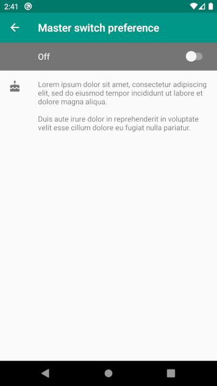
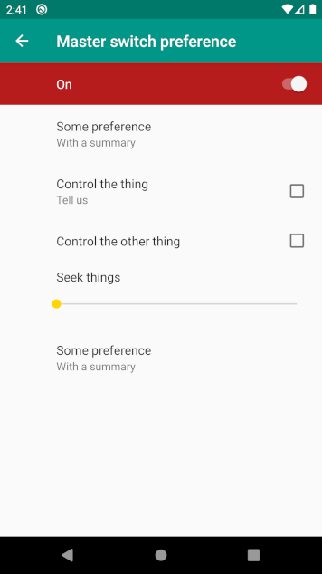
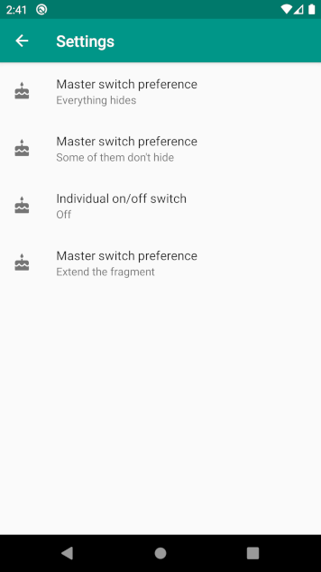
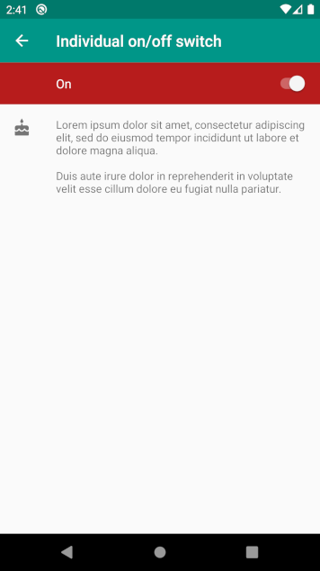

# MasterSwitchPreference

MasterSwitchPreference provides an AndroidX implementation of two patterns found in the [Material Design guidelines for Android settings](https://material.io/design/platform-guidance/android-settings.html#label-and-secondary-text). 

  - Master on and off switch
  
&nbsp;&nbsp;&nbsp;&nbsp;&nbsp;&nbsp;   

  - Individual on/off switch
  
  &nbsp;&nbsp;&nbsp;&nbsp;&nbsp;&nbsp; 
